# SmartChain ESG Platform - ERD

## Entity Relationship Diagram

```mermaid
erDiagram
    %% ==================== USER DOMAIN ====================
    Industry {
        Long industryId PK
        String name
        String code
    }

    Company {
        Long companyId PK
        Long industry_id FK
        String name
        String scale
        Long sales
        Long asset
        String businessNumber UK
        String companyType "TIER1, TIER2"
        String ceoName
        String address
        String contactEmail
        String contactPhone
        String status "ACTIVE, INACTIVE"
        LocalDateTime createdAt
        LocalDateTime updatedAt
    }

    Domain {
        Long domainId PK
        String code UK "ESG, SAFETY, COMPLIANCE"
        String name
        String description
        Boolean isActive
        LocalDateTime createdAt
        LocalDateTime updatedAt
    }

    Role {
        Long roleId PK
        String name
        String code UK "GUEST, DRAFTER, APPROVER, REVIEWER"
    }

    User {
        Long userId PK
        Long company_id FK
        Long role_id FK
        String name
        String email UK
        String userPassword
        LocalDateTime lastLoginAt
        String status "ACTIVE, INACTIVE, SUSPENDED"
        LocalDateTime createdAt
        LocalDateTime updatedAt
    }

    UserDomainRole {
        Long id PK
        Long user_id FK
        Long domain_id FK
        Long role_id FK
        LocalDateTime createdAt
        LocalDateTime updatedAt
    }

    RoleRequest {
        Long requestId PK
        Long user_id FK
        Long company_id FK
        Long domain_id FK
        Long processed_by FK
        String requestedRole
        String reason
        String status "PENDING, APPROVED, REJECTED"
        String rejectReason
        LocalDateTime decidedAt
        LocalDateTime createdAt
    }

    %% ==================== DIAGNOSTIC DOMAIN ====================
    Category {
        Long categoryId PK
        String name "Environment, Social, Governance"
    }

    Question {
        Long questionId PK
        Long industry_id FK
        Long category_id FK
        String content
        String questionType "QUAL, QUANT"
        String inputType "TEXT, RADIO, FILE"
        Boolean isActive
        String unit
    }

    Campaign {
        Long campaignId PK
        Long domain_id FK
        String campaignCode UK
        Long ownerCompanyId
        String title
        String content
        LocalDate periodStartDate
        LocalDate periodEndDate
        LocalDate deadline
        LocalDateTime createdAt
        LocalDateTime updatedAt
    }

    Diagnostic {
        Long diagnosticId PK
        Long campaign_id FK
        Long company_id FK
        Long domain_id FK
        String diagnosticCode UK
        String title
        Long drafterId
        Long approverId
        Long reviewerId
        String status "WRITING, SUBMITTED, RETURNED, APPROVED, REVIEWING, COMPLETED"
        int qualitativeProgress
        int quantitativeProgress
        Integer overallScore
        LocalDate periodStartDate
        LocalDate periodEndDate
        LocalDate deadline
        LocalDateTime submittedAt
        LocalDateTime createdAt
        LocalDateTime updatedAt
    }

    ResultQual {
        Long resultQualId PK
        Long diagnostic_id FK
        Long question_id FK
        Boolean answer
    }

    ResultQuant {
        Long resultId PK
        Long diagnostic_id FK
        Long question_id FK
        BigDecimal valNum
        String valText
    }

    DiagnosticHistory {
        Long historyId PK
        Long diagnostic_id FK
        Long actor_id FK
        String action "CREATED, SUBMITTED, APPROVED, REJECTED"
        String previousStatus
        String newStatus
        String comment
        LocalDateTime createdAt
    }

    Report {
        Long reportId PK
        Long diagnostic_id FK "OneToOne"
        String filePath
        String status
        String riskLevel "HIGH, MEDIUM, LOW"
        LocalDateTime createdAt
    }

    DataPackage {
        Long dataPackageId PK
        Long diagnosticId
        Long createdBy
        String filePath
        String manifest "JSON"
        Long fileSize
        LocalDateTime createdAt
    }

    %% ==================== EVIDENCE DOMAIN ====================
    EvidenceFile {
        Long resultFileId PK
        Long result_id FK
        Long diagnostic_id FK
        String filePath
        String originalFileName
        Long fileSize
        String mimeType
        String parsingStatus "WAITING, PROCESSING, SUCCESS, FAILED"
        BigDecimal valNum
        String valText
        String parsingMetaInfo "TEXT"
        LocalDateTime createdAt
        LocalDateTime updatedAt
    }

    %% ==================== APPROVAL DOMAIN ====================
    Approval {
        Long approvalId PK
        Long diagnostic_id FK
        Long requester_id FK
        Long approver_id FK
        String status "WAITING, APPROVED, REJECTED"
        String requestComment
        String approverComment
        LocalDate deadline
        LocalDateTime processedAt
        LocalDateTime submittedToReviewerAt
        LocalDateTime createdAt
        LocalDateTime updatedAt
    }

    %% ==================== REVIEW DOMAIN ====================
    Review {
        Long reviewId PK
        Long diagnostic_id FK
        Long company_id FK
        Long assigned_reviewer_id FK
        Long domain_id FK
        Long processed_by_id FK
        String status "REVIEWING, APPROVED, REVISION_REQUIRED"
        Integer score
        String riskLevel "LOW, MEDIUM, HIGH"
        LocalDateTime submittedAt
        LocalDateTime processedAt
        String comment
        String categoryCommentE
        String categoryCommentS
        String categoryCommentG
        LocalDateTime createdAt
        LocalDateTime updatedAt
    }

    %% ==================== AI DOMAIN ====================
    AiAnalysisResult {
        Long id PK
        Long diagnostic_id FK
        String domainCode "ESG, SAFETY, COMPLIANCE"
        String packageId
        String riskLevel "LOW, MEDIUM, HIGH"
        String verdict "PASS, WARN, NEED_CLARIFY, NEED_FIX"
        String whySummary
        String resultJson "TEXT"
        LocalDateTime analyzedAt
        LocalDateTime createdAt
        LocalDateTime updatedAt
    }

    %% ==================== JOB DOMAIN ====================
    AsyncJob {
        Long id PK
        String jobId UK
        String jobType "FILE_PARSING, REPORT_GENERATION, etc"
        String status "PENDING, RUNNING, SUCCEEDED, FAILED"
        int progress
        String message
        Long requesterId
        Long targetId
        String requestPayload
        LocalDateTime startedAt
        LocalDateTime completedAt
        LocalDateTime estimatedCompletionAt
        String resultUrl
        String errorCode
        String errorMessage
        boolean retryable
        LocalDateTime createdAt
        LocalDateTime updatedAt
    }

    %% ==================== NOTIFICATION DOMAIN ====================
    Notification {
        Long notificationId PK
        Long user_id FK
        String type "APPROVAL_REQUEST, APPROVAL_RESULT, etc"
        String title
        String message
        String linkUrl
        boolean isRead
        LocalDateTime createdAt
        LocalDateTime updatedAt
    }

    %% ==================== LOG DOMAIN ====================
    ActivityLog {
        Long logId PK
        Long user_id FK
        String action "LOGIN, LOGOUT, FILE_UPLOAD, etc"
        String status
        String ipAddress
        String userAgent
        String targetType "DIAGNOSTIC, FILE, USER"
        String targetId
        String description
        LocalDateTime createdAt
    }

    %% ==================== AUTH DOMAIN ====================
    EmailVerificationCode {
        Long id PK
        String email
        String code
        LocalDateTime expiresAt
        boolean verified
        LocalDateTime createdAt
        LocalDateTime updatedAt
    }

    %% ==================== RELATIONSHIPS ====================

    %% User Domain
    Industry ||--o{ Company : "has"
    Industry ||--o{ Question : "has"
    Company ||--o{ User : "employs"
    Role ||--o{ User : "assigned to"
    User ||--o{ UserDomainRole : "has"
    Domain ||--o{ UserDomainRole : "in"
    Role ||--o{ UserDomainRole : "as"
    User ||--o{ RoleRequest : "requests"
    Company ||--o{ RoleRequest : "for"
    Domain ||--o{ RoleRequest : "in"
    User ||--o{ RoleRequest : "processes"

    %% Diagnostic Domain
    Category ||--o{ Question : "contains"
    Domain ||--o{ Campaign : "belongs to"
    Campaign ||--o{ Diagnostic : "contains"
    Company ||--o{ Diagnostic : "owns"
    Domain ||--o{ Diagnostic : "in"
    Diagnostic ||--o{ ResultQual : "has"
    Diagnostic ||--o{ ResultQuant : "has"
    Question ||--o{ ResultQual : "answered by"
    Question ||--o{ ResultQuant : "answered by"
    Diagnostic ||--o{ DiagnosticHistory : "has"
    User ||--o{ DiagnosticHistory : "acted by"
    Diagnostic ||--|| Report : "generates"

    %% Evidence Domain
    Diagnostic ||--o{ EvidenceFile : "has"
    ResultQuant ||--o{ EvidenceFile : "attached to"

    %% Approval Domain
    Diagnostic ||--o{ Approval : "requires"
    User ||--o{ Approval : "requests"
    User ||--o{ Approval : "approves"

    %% Review Domain
    Diagnostic ||--o{ Review : "reviewed in"
    Company ||--o{ Review : "subject of"
    User ||--o{ Review : "assigned to"
    Domain ||--o{ Review : "in"
    User ||--o{ Review : "processed by"

    %% AI Domain
    Diagnostic ||--o{ AiAnalysisResult : "analyzed in"

    %% Notification Domain
    User ||--o{ Notification : "receives"

    %% Log Domain
    User ||--o{ ActivityLog : "performs"
```



## 테이블 요약

### 1. User Domain (사용자 관리)
| 테이블 | 설명 |
|--------|------|
| `industry` | 업종 마스터 (제조업, IT 등) |
| `company` | 회사 정보 (협력사/원청) |
| `domain` | 서비스 도메인 (ESG, SAFETY, COMPLIANCE) |
| `role` | 역할 정의 (GUEST, DRAFTER, APPROVER, REVIEWER) |
| `user` | 사용자 계정 |
| `user_domain_role` | 사용자-도메인-역할 매핑 (다대다) |
| `role_request` | 역할 권한 요청 |

### 2. Diagnostic Domain (진단 관리)
| 테이블 | 설명 |
|--------|------|
| `category` | ESG 카테고리 (E, S, G) |
| `question` | 진단 질문 (정성/정량) |
| `campaign` | 진단 캠페인 |
| `diagnostic` | 진단 메인 테이블 |
| `result_qual` | 정성 평가 결과 |
| `result_quant` | 정량 평가 결과 |
| `diagnostic_history` | 진단 상태 변경 이력 |
| `report` | 진단 리포트 |
| `data_package` | 내보내기 데이터 패키지 |

### 3. Evidence Domain (증빙 관리)
| 테이블 | 설명 |
|--------|------|
| `evidence_file` | 증빙 파일 및 파싱 결과 |

### 4. Workflow Domain (워크플로우)
| 테이블 | 설명 |
|--------|------|
| `approval` | 결재 요청/처리 |
| `review` | 원청 심사 |

### 5. AI Domain (AI 분석)
| 테이블 | 설명 |
|--------|------|
| `ai_analysis_result` | AI 분석 결과 저장 |

### 6. System Domain (시스템)
| 테이블 | 설명 |
|--------|------|
| `async_job` | 비동기 작업 상태 |
| `notification` | 사용자 알림 |
| `activity_log` | 활동 로그 |
| `email_verification_code` | 이메일 인증 코드 |

## 핵심 관계

### 도메인 기반 권한 체계
```
User ──┬── UserDomainRole ──┬── Domain (ESG, SAFETY, COMPLIANCE)
       │                    │
       │                    └── Role (DRAFTER, APPROVER, REVIEWER)
       │
       └── Company
```

### 진단 워크플로우
```
Campaign ──── Diagnostic ──┬── Approval (결재자 승인)
                           │
                           └── Review (수신자 심사)
```

### AI 분석 흐름
```
Diagnostic ──── EvidenceFile ──── AiAnalysisResult
                    │
                    └── (AI Run API 호출)
```

## 상태 코드

### DiagnosticStatus
- `WRITING`: 작성 중
- `SUBMITTED`: 제출됨 (결재 대기)
- `RETURNED`: 반려됨
- `APPROVED`: 승인됨
- `REVIEWING`: 심사 중
- `COMPLETED`: 완료

### ApprovalStatus
- `WAITING`: 대기
- `APPROVED`: 승인
- `REJECTED`: 거절

### ReviewStatus
- `REVIEWING`: 심사 중
- `APPROVED`: 승인
- `REVISION_REQUIRED`: 수정 요청
